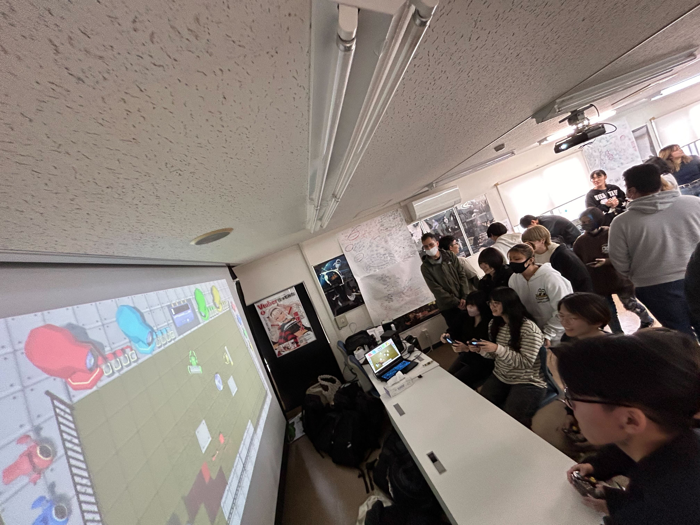
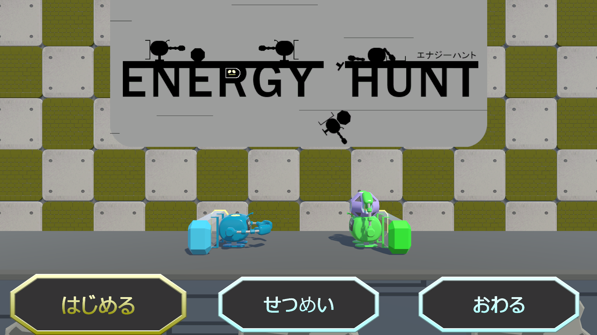
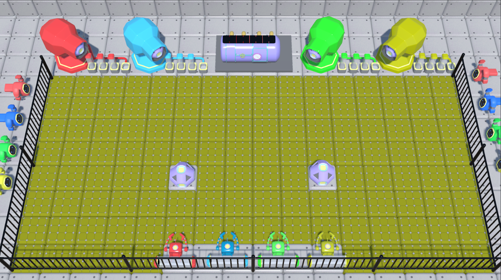
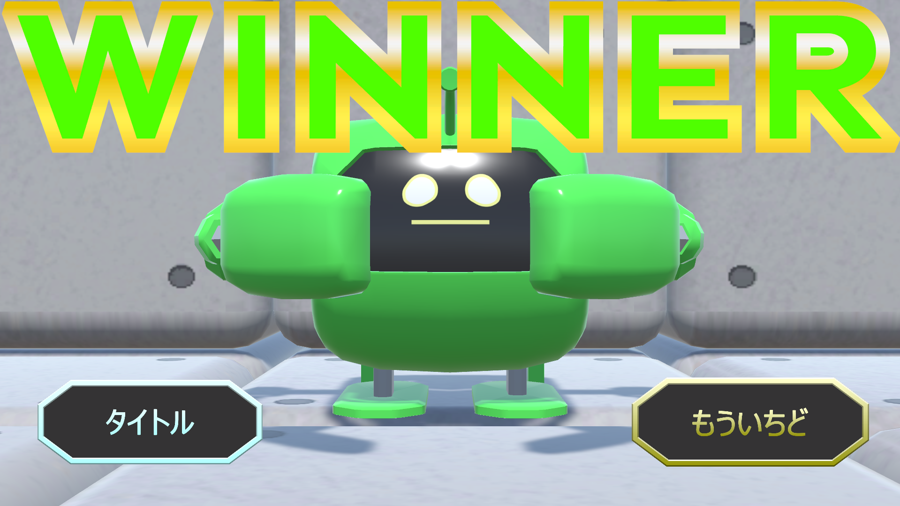

# EnergyHunt

## ファイル構成
* [Unityデータ](./ProjectDate/)
* [ビルドデータ](./BuildDate/)

## 概要

## ジャンル
4人対戦型パーティーゲーム

## プラットフォーム
デスクトップ

## 担当プログラムファイル
* [タイトルシーンのキャラクターアニメーションやUIプログラム](./ProjectDate/Energy_Hunt_v02/Assets/TitleScene/Script/TitleScript.cs)
* [タイトルで使用するPlayer2のスクリプト](./ProjectDate/Energy_Hunt_v02/Assets/TitleScene/Script/Player2Script.cs)
* [タイトルで使用するエネルギーコアのスクリプト](./ProjectDate/Energy_Hunt_v02/Assets/TitleScene/Script/EnergyCoreScript.cs)
* [勝利したプレイヤーにカメラをフォーカスするプログラム](./ProjectDate/Energy_Hunt_v02/Assets/Title_ResultSceneFolder/SceneScript/CameraFocusScript.cs)
* [ゲームスタート前のカウントダウンのUIプログラム](./ProjectDate/Energy_Hunt_v02/Assets/Title_ResultSceneFolder/SceneScript/CountdownScript.cs)
* [リザルトシーンのスクリプト](./ProjectDate/Energy_Hunt_v02/Assets/Title_ResultSceneFolder/Result/ResultScript.cs)

## ゲームルール
このゲームは、4人でエネルギーを貯めたり奪ったりして戦うアクションゲームです。  
エネルギーボールを持つと背中のエネルギーがチャージされ、相手に当てると相手のエネルギーを奪うことができます。満タンになったエネルギーを自分の陣地の大砲にセットして、先に4つタンクをセットしたプレイヤーが勝利となります。

## 積極的に頑張ったところ
今回は、ちゃんとゲーム中身の仕様に関わったところは少ないですが、ゲームの企画やどの画面に行ってもプレイヤーを楽しませることのできるような見た目にするためのUIプログラムなどに力を入れました。  
ゲームの企画では、今回作ったゲームは最初作っている時点からかなりゲームルールが分かりずらかったため、それをどうにかしようとチームメンバーとの話し合いや、アイディア出しを積極的に取り組み分かりにくさの改善に務めました。  
ゲーム内の画面ではタイトルシーンの選択画面のUIの拡大縮小アニメーションや、タイトルシーンが急に出てくるようなアニメーション、そしてタイトルシーンでもゲームのある程度のルールを把握してもらえるようにキャラクターを全てアニメーションを使わずにプログラムだけでキャラクターのオブジェクトを動かし、ゲーム内で行う主な操作を視覚的に分かりやすくしました。

## 試遊会
学校で作品展示試遊会を行い、制作途中のゲームを多くの方に遊んでもらいました。  
事前にKGIを「64人プレイ」、KPIを「16回稼働」と設定し、目標達成に向けて呼び込みも積極的に行いました。  
結果として目標人数には届きませんでしたが、リピートして遊んでくれる方が多くいました。  

### アンケート結果
試遊会で遊んでもらった人たちにアンケートを答えていただき、プレイヤーとなるお客様の声を直接聞く事が出来ました。

## Unityバージョン
2022.3.24f1

## 製作期間
約2ヶ月

## メンバー (役割)
* 友利徠夢（プログラマー）
* 前田祐貴 (プログラマー)
* 波照間煌斗 (プログラマー)
* 仲里琉偉 (デザイナー)
* 宮里謙吾 (デザイナー)

## ゲームスクリーンショット

