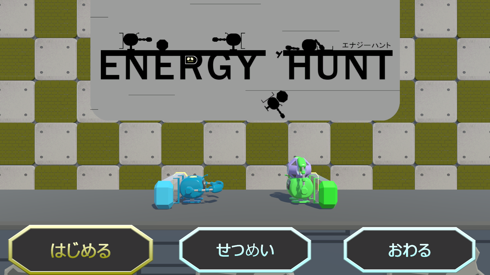
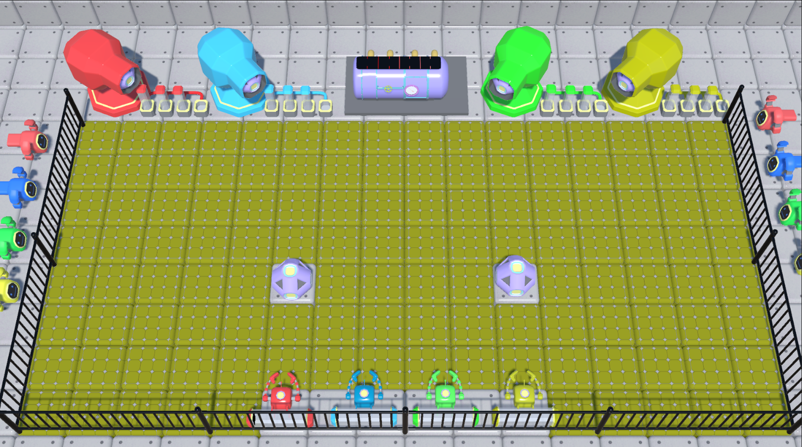
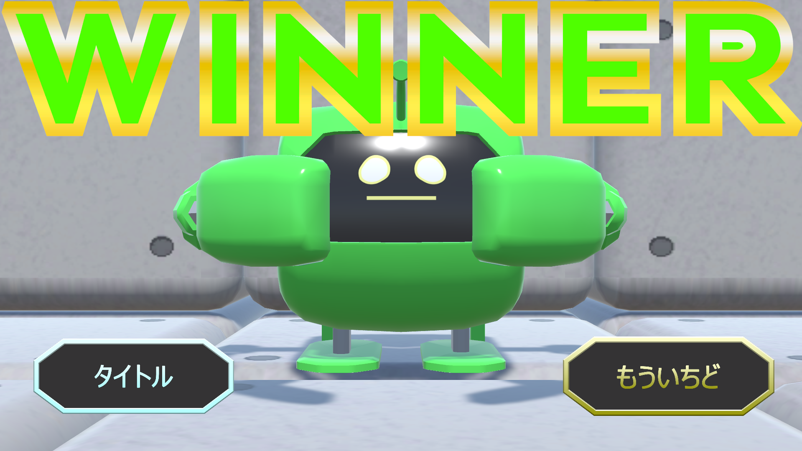

# EnergyHunt

## ファイル構成
*[Unityデータ](./ProjectDate/)
*[ビルドデータ](./BuildDate/)

## 概要

## ジャンル
4人対戦型パーティーゲーム

## プラットフォーム
デスクトップ

## 担当プログラムファイル
*[タイトルシーンのキャラクターアニメーションやUIプログラム](./ProjectDate/Energy_Hunt_v02/Assets/TitleScene/Script/TitleScript.cs)
*[タイトルで使用するPlayer2のスクリプト](./ProjectDate/Energy_Hunt_v02/Assets/TitleScene/Script/Player2Script.cs)
*[タイトルで使用するエネルギーコアのスクリプト](./ProjectDate/Energy_Hunt_v02/Assets/TitleScene/Script/EnergyCoreScript.cs)
*[勝利したプレイヤーにカメラをフォーカスするプログラム](./ProjectDate/Energy_Hunt_v02/Assets/Title_ResultSceneFolder/SceneScript/CameraFocusScript.cs)
*[ゲームスタート前のカウントダウンのUIプログラム](./ProjectDate/Energy_Hunt_v02/Assets/Title_ResultSceneFolder/SceneScript/CountdownScript.cs)
*[リザルトシーンのスクリプト](./ProjectDate/Energy_Hunt_v02/Assets/Title_ResultSceneFolder/Result/ResultScript.cs)

## ゲームルール
ステージには2つのエネルギーボールがあり、そのエネルギーボールを持っている間は自分の背中にあるタンクにエネルギーが溜まっていく。そのタンクが満タンになったら自分の色と同じ色の大砲のところにタンクをセットしに行き、先に4つセットしたプレイヤーが勝ちというゲーム。エネルギーボールを投げて相手を倒すと、相手が今まで貯めていたエネルギーを総取りすることができる。コツコツ自分でエネルギーをためるか、相手を倒して一発逆転を狙うかの駆け引きも楽しむことができる。

## Unityバージョン
2022.3.24f1

## 製作期間
約2ヶ月

## メンバー (役割)
*友利徠夢（プログラマー）
*前田祐貴 (プログラマー)
*波照間煌斗 (プログラマー)
*仲里琉偉 (デザイナー)
*宮里謙吾 (デザイナー)

## ゲームスクリーンショット

